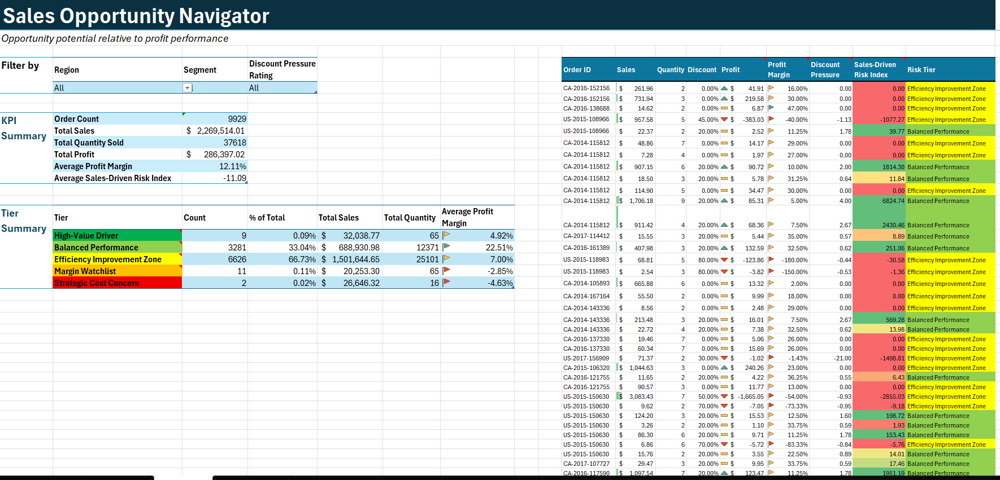
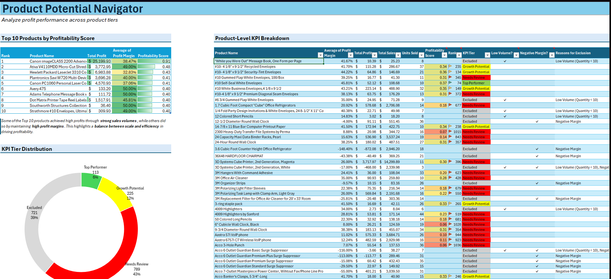

# Superstore Sales & Product Analysis

This project analyzes Superstore sales and product data using Excel (Power Query & Power Pivot), with the goal of identifying profit optimization opportunities and product performance patterns. It features interactive dashboards for both sales and product-level analysis and is being prepared for future migration into Power BI.

---

## Project Summary

- Cleaned and transformed Superstore data using Power Query and Power Pivot in Excel.
- Built two interactive dashboards:
  - **Sales Analysis Dashboard**: Analyzes sales performance by region, segment, and discount pressure.
  - **Product Analysis Dashboard**: Evaluates product-level profitability, ranking, and KPI classification.
- Derived key metrics to quantify sales-driven risk and product profitability.
- Currently developing a structured data model for future deployment in Power BI.

---

## Objectives

1. Identify high-impact regions and segments for profit optimization.
2. Uncover product-level improvement opportunities through KPI-based classification.
3. Build an integrated, scalable dashboard using a star-schema model in Power BI.

---

## Tools Used

- Microsoft Excel (Power Query, Power Pivot, FILTER, INDEX-MATCH, IF)
- Power BI (in progress)
- Kaggle (Superstore dataset)

---

## Key Dashboards

### Sales Analysis Dashboard

- **Filter Panel**: Region, Segment, Discount Pressure Tier
- **KPI Summary Table**: Order Count, Total Sales, Quantity, Profit, Avg Profit Margin, Risk Index
- **Tier Summary Table**: Risk Tier breakdown (Count, %, Total Sales, Avg Margin)
- **Interactive Table**: 
  - `Order ID`, `Sales`, `Quantity`, `Discount`, `Profit`
  - Derived: `Profit Margin`, `Discount Pressure`, `Sales-Driven Risk Index`, `Risk Tier`

### Product Analysis Dashboard

- **Top 10 Products Table**: Ranked by Profitability Score
- **KPI Summary Table**: 
  - `Product Name`, `Total Profit`, `Total Sales`, `Units Sold`, `Avg Profit Margin`, `Profitability Score`, `KPI Tier`
- **Donut Chart**: KPI Tier Distribution
- **Flags**: 
  - `Low Volume?`, `Negative Margin?`, `Reason for Exclusion`
- Derived metrics created using `IF` logic and `INDEX-MATCH`.

---

## Dashboard Preview

### Sales Analysis Dashboard


- Filter by Region, Segment, and Discount Pressure Tier.
- Dynamic KPIs for order count, sales, quantity, profit, and risk indicators.
- Interactive tier-based performance breakdown.

### Product Analysis Dashboard


- Top 10 products ranked by profitability score.
- Tier classification and flag indicators for low volume or negative margin products.
- KPI tier distribution visual.

**View Excel Dashboard (hosted on OneDrive):**  
[Open in Excel Online](https://xuliujun1-my.sharepoint.com/:x:/g/personal/75900_office365proplus_co/EbdAc9CYcsNHpPsabAe67dwBFTmX9lyyo9N9GB7XeVnpHA?e=WygbN4)

---

## Derived Metrics

- `Profit Margin` = `Profit / Sales`
- `Discount Pressure Tier` = categorized discount levels
- `Sales-Driven Risk Index` = composite score (discount vs margin)
- `Risk Tier` = classified risk level based on risk index
- `Profitability Score` = weighted product performance metric
- `KPI Tier` = product classification (e.g., Tier 1 - High Profitability)
- `Reason for Exclusion` = logic-based explanation for product ranking filter

---

## Dashboard Purpose Disclaimer

The current Excel dashboard serves as a **foundational layout** to explore and understand the structure of the Superstore data. It is intentionally kept simple and focused on:

- Validating the data after cleansing
- Identifying high-level trends and performance gaps
- Deriving key metrics such as profit margin, discount pressure, and product profitability

This dashboard is **not meant to be a polished final product**, but rather a working prototype to:
- Support metric development
- Design future analytical logic
- Guide the transition into a full Power BI model

Future development will focus on enhancing interactivity, adding deeper insights, and scaling the analysis into a structured star-schema for enterprise-style reporting.

---

## Power BI Data Model Preview

This project is being extended into Power BI using a star-schema model for optimal performance and flexibility.

```text
          ┌────────────┐
          │ DimProduct │
          └────┬───────┘
               │
               │
    ┌──────────▼───────┐
    │   FactSales      │
    └────┬──────┬──────┘
         │      │
         │      │
 ┌──────▼───┐ ┌─▼────────────┐
 │DimCustomer│ │DimRegionTier│
 └───────────┘ └─────────────┘
```

## Table Definitions

| Table Name       | Type        | Description |
|------------------|-------------|-------------|
| `FactSales`      | Fact Table  | Central table containing transaction-level data such as Order ID, Sales, Quantity, Discount, Profit, and derived KPIs like Profit Margin and Risk Index. |
| `DimProduct`     | Dimension   | Contains product-level details including Product Name, Category, Sub-Category, Profitability Score, KPI Tier, and performance flags. |
| `DimCustomer`    | Dimension   | Customer-related data including Customer ID, Customer Name, Segment, Country, State, and Region. |
| `DimRegionTier`  | Dimension   | Derived table summarizing Region, Segment, and Discount Pressure Tier combinations with aggregated KPI metrics and risk tier classification. |

---

## Future Enhancements

- Migrate all structured and derived data from Excel to Power BI.
- Design a fully interactive Power BI dashboard with unified filters, drilldowns, and dynamic visuals.
- Introduce additional insight layers such as:
  - Product category profitability comparison.
  - Customer-level segmentation (where data supports it).
  - Discount effectiveness and margin erosion analysis.
- Expand the model to support what-if scenarios or predictive indicators using DAX or Power BI features.

